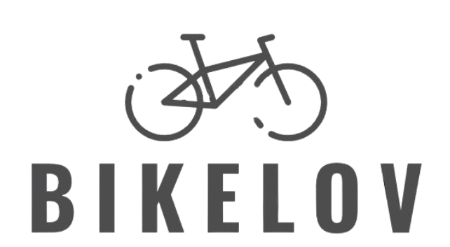
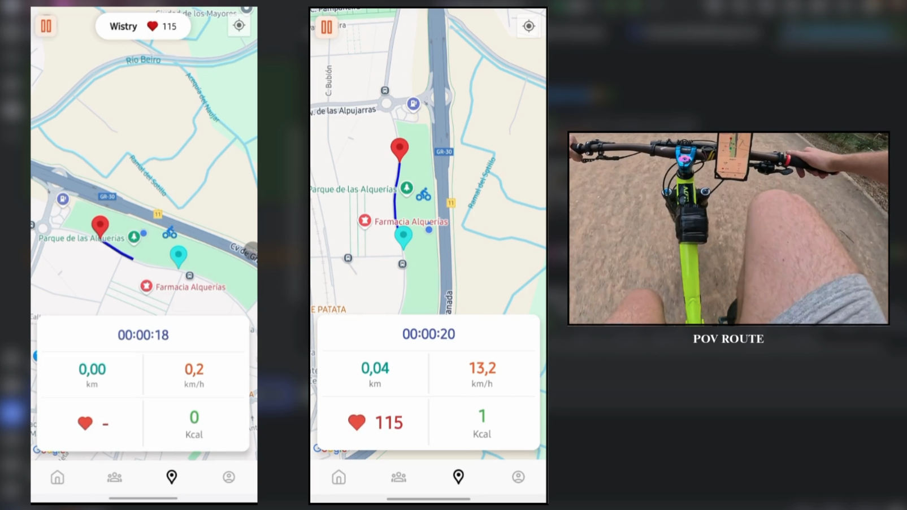

 
---

[Resumen](#resumen) ✦ [Funcionalidades](#funcionalidades) ✦ [Apartado Técnico](#apartado-técnico) ✦ [Compatibilidad](#compatibilidad) ✦ [Demo](#demo)

#### App móvil para ciclistas, enfocada en fomentar las rutas grupales y la interacción entre usuarios. 

 

> \[!NOTE]
>
> - Este readme tienes dos versiones, en español y en ingles.  <a href="./README.md">ES</a> 
> - Thats readme has two version in spanish and in english.   <a href="./README_EN.md">EN</a> 

##  Resumen

BikeLov combina el mundo **deportivo** con un potente enfoque **social**. Diseñada especialmente para la **realización de rutas grupales en bicicleta**, permite a los usuarios **visualizar en tiempo real** la **posición** y las **pulsaciones** de sus compañeros en el mapa, facilitando la optimización del rendimiento grupal.

La app se divide principalmente en dos bloques:

• **Deportivo**: ofrece todo lo necesario para realizar rutas ciclistas, desde su creación mediante mapas, el seguimiento con sensores y la monitorización de parámetros clave, hasta el análisis detallado tras finalizar la ruta.

• **Social**: integra funcionalidades similares a las redes sociales actuales. Compartir rutas, seguir a otros usuarios, crear grupos ciclistas y mantener chats privados.

---

## Funcionalidades

1. **Crear y compartir rutas:**  interfaz de mapa para trazar rutas personalizadas y compartirlas con otros.

2. **Seguimiento en tiempo real:**  visualización en vivo de tu ruta y la de tus compañeros.

3. **Gestión de grupos ciclistas:**  crear, unirse y administrar grupos de usuarios.

4. **Seguimiento de usuarios y mensajes privados:**  añadir usuarios y comunicarte de forma directa.

5. **Feed social:**  publicaciones visibles para los usuarios que sigues.

6. **Análisis de la ruta:**  estadísticas y resumen de cada recorrido.

---

## Apartado Técnico

El desarrollo de BikeLov se ha realizado aplicando una arquitectura **MVVM** para mejorar la organización del código y facilitar su mantenimiento.

**Tecnologías utilizadas:**

- **Frontend:** Android Studio, Java, Android Jetpack.
- **Backend:** Google Cloud, Firebase y Cloudinary.
- **Base de datos:** Firebase Realtime Database (NoSQL), optimizada para datos en tiempo real.
- **Servicios adicionales:** Firebase Authentication, Google Maps SDK, Sensor API (frecuencia cardíaca).

---

## Compatibilidad

BikeLov está diseñada para dispositivos con **Android 8.0 (API 26)** o superior.

**Sensores:** compatible únicamente con sensores de frecuencia cardíaca de la marca **Polar**, gracias a su API propietaria y amplia compatibilidad con Android. Sensores de otras marcas no se han integrado debido a limitaciones de API y estabilidad.

**Dependencias:** la app requiere permisos de ubicación y acceso a sensores Bluetooth para su funcionalidad completa.

---

## Demo 

---

